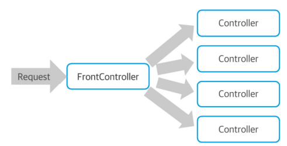

# 4. 스프링과 스프링 Web MVC

> ## 4.0 환경설정


> ## 4.1 의존성 주입과 스프링

스프링은 프레임워크로 원래 웹 뿐만아니라 객체지향의 **'의존성 주입(dependency injection)'** 기법을 적용할 수 있는 객체지향 프레임워크였다.<br>
2000년 당시 자바 진영에서 JavaEE의 여러 스펙을 정의하고, 비대해지는 동안 스프링 프레임워크는 '경량 프레임워크'를 목표로 만들어 졌다.<br>

스프링 프레임워크는 가장 중요한 '코어'역할을 하는 라이브러리와 여러 추가 라이브러리를 결합하는 형태로 프로젝트를 구성하는데 가장 대표적인 웹 MVC로 구현을 쉽게할 수 있는 'Spring Web MVC'나 JDBC를 쉽게 처리할 수 있는 `MyBatis`를 연동하는 `mybatis-spring`과 같은 라이브러리가 존재한다.

- ## 의존성 주입
의존성 주입은 어떻게 하면 **'객체와 객체 간의 관계를 더 유연하게 유지할 것인가?'** 에 대한 고민으로 객체의 생성과 관계를 효과적으로 분리할 수 있는 방법에 대한 고민이다.

예를 들어 이전의 장의 모든 컨트롤러들은 TodoService, MemberService와 같은 서비스 객체를 이용해ㅑ 한다. 이 경우 컨트롤러는 서비스 객체에 의존적이라고 표현한다.
즉 의존성이란 **하나의 객체가 자신이 해야 하는 일을 하기 위해 다른 객체의 도움이 필수적인 관계**를 의미한다.

스프링은 이러한 문제를 해결하기 위해 다양한 방식으로 필요한 객체를 찾아 사용할 수 있도록 XML 설정이나 자바 설정 등을 이용한다.

- ## Spring 설정 파일

스프링 프레임워크는 자체적으로 객체를 생성, 관리하면서 필요한 곳으로 객체를 주입하는 역할을 하는데 이를 위해 설장 파일이나 어노테이션등을 이용해야한다.

스피링이 관리하는 객체들은 빈(Bean)이라는 이름으로 불리는데 프로젝트 내에서 어떤 빈들을 어떻게 관리할 것인지 설정하는 설정파일을 작성한다.
스프링 빈 설정은 XML을 이용하거나 별도의 클래스를 이용하는 자바 설정이 가능하다. 예제에서는 XML 설정을 이용하도록 하고, 스프링 부트에서 자바 설정을 이용하고자 한다.

> 스프링 빈 설 정 테스트

- `@Autowired`

스프링에서 사용하는 의존성 주입 관련 어노테이션으로 해당 타입의 빈이 존재하면 여기서 주입하기를 원한다 는 의미
- `@ExtendWith(SpringExtensition.class)`

JUnit5 버전에서 'spring-test'를 이용하기 위한 설정
- `@ContextConfiguration`

스프링 설정 정보를 로딩하기 위해 사용.
현재 XML로 설정되어 있기 때문에 locations 송석을 사용.
자바 설정을 사용하는 경우에는 class 속성을 이용한다.

> ApplicationContext와 빈

서블릿이 존재하는 공간을 서블릿 건텍스트(Servlet Context)라 한 것 처럼, 스프링에서 **'빈(Bean)'**이라고 부르는 객체들을 관리하기 위해 ApplicationContext를 활용한다.

예제에서 `ApplicaiotnContext`는 root-context.xml을 이용해 스프링이 실행되고 ApplicationContext 객체가 생성된다.
root-context.xml에서 SampleService와 SampleDAO가 <bean>으로 지정되어있기 떄문에 해당 클래스의 객체를 생성해서 관리한다.


> `@Autowired`의 의미와 필드 주입

테스트에서 `@Autowired`가 처리된 부분에 맞는 빈(Bean)이 존재하는지 확인하고 이를 테스트 코드 실행 시 주입하게 된다.
멤버 변수에 직접 `@Autowired`를 선언하는 방식을 **필드 주입(Field Injection)** 방식이라고 한다.
`@Autowired`를 이용해 필요한 타입을 주입받을 수 있다.

> `<context:compoenet-scan>`

스프링은 직접 클래스를 작성하거나, 객체를 생성하지 않는다.
이 역할은 스프링 내부에서 진행되며, ApplicaiotnContext가 생성된 객체들을 관리한다.

- ### `@Service`, `@Repository`

서블릿에서도 `@WebServlet`이나 `@WebFilter`와 같이 다양한 어노테이션이 존재하듯, 스프링 프레임워크는 애플리케이션 전체를 커버하기 때문에 다양한 종류의 어노테이션을 사용한다.

> - `@Controller` : MVC의 컨트롤러를 위한 어노테이션
> - `@Service` : 서비스 계층의 객체를 위한 어노테이션
> - `@Repository` : DAO와 같은 객체를 위한 어노테이션 //객체를 스프링의 빈(Bean)으로 처리
> - `@Compoenet` : 일반 객체나 유틸리티 객체를 위한 어노테이션

SampleDAO는 클래스의 객체가 스프링에서 빈(Bean)으로 관리될 수 있도록 `@Repository`라는 어노테이션 추가한다.
SampleService에는 `@Service` 어노테이션을 추가한다.
이후 테스트 코드를 실행해 정상적으로 동작하는지 확인한다.

> ### 생성자 주입 방식

생성자 주입 방식은 다음과 같은 규칙으로 작성된다.

- 주입 받아야 하는 객체의 변수는 final로 작성한다.
- 생성자를 이용해 해당 변수를  생성자의 파라미터로 지정한다.

생성자 주입 방식은 객체를 생성할 때 문제가 발생하는지 미리 확인할 수 있기 때문에 필드 주입이나 Setter 주입 방식보다 선호되는 방식이다.
Lombok에서는 `@RequiredArgsConstructor`를 이용하면 필요한 생성자 함수를 자동으로 작성할 수 있다.

> ### 인터페이스를 이용한 느슨한 결합(loose coupling)

스프링이 의존성 주입을 가능하게 하지만 유연한 프로그램을 설계하기 위해서는 인터페이스를 이용해 다른 클래스의 객체도 쉽게 변경할 수 있도록 해야한다.
인터페이스와 같이 추상화된 타입을 이용하면 이러한 문제를 피할 수 있다.
인페이스를 이용하면 실제 객체를 모르고 타입만 이용해 코드를 작성하는 일이 가능하기 때문이다.

- #### 하나의 인터페이스를 두개 이상의 객체를 공유할 때 
1. `@Primary` 어노태이션을 지정하여 우선순위를 부여한다.
2. `@Qualifier('상태')` 어노테이션을 지정하여 특정 상황에서 실행될 수 있도록 한다. '상태'는 주로 'normal'이 사용된다.

> ### 스프링의 Bean으로 지정되는 객체들
모든 클래스의 객체가 Bean으로 처리되는 것은 아니다. <br>
Bean으로 등록되는 객체는 **'핵심 배역'** 을 하는 객체들로 오랜 시간 동안 프로그램 내에 상주하면서 중요한 역할을 하는 '역할' 중심의 객체들이다. (DAO) <br>
DTO나 VO같이 '데이터'에 중점을 두고 설계된 객체들은 Bean으로 등록하지 않든다는 것이다.

> ### XML이나 어노테이션으로 처리하는 객체
Bean으로 처리할 때 XML 설정을 이용하거나 어노테이션으로 처리할 수 있다. 이에 대한 기준은 **'코드를 수정할 수 있는가'** 로 판단한다.<br>
예로 jar파일로 추가하는 클래스의 객체를 Bean으로 처리해야한다면 해당 코드가 존재하지 않기 때문에 어노테이션을 추가할 수 없다는 문제가 생긴다. <br>
이러한 객체들은 XML에서 <bean>을 이용해 처리하고, 직접 작성되는 클래스는 어노테이션을 이용한다.

- ## 웹 프로젝트를 위한 스프링 세팅

스프링 구조를 보면 ApplicationContext라는 객체가 존재하고 Bean으로 등록된 객체들은 ApplicationContext 내에 생성되어 관리되는 구조이다.


이렇게 만들어진 ApplicationContext가 웹 애플리케이션에서 동작하려면 웹 애플리케이션이실행될 때 스프링을 로딩해 웹 애플리케이션 내부에 ApplicatoinContext를 생성해야 한다.<br>
이를 위해 web.xml을 이용해 리스너('spring-webmvc')를 설정해야한다. 

-log4j2.xml 설정
```xml
<?xml version="1.0" encoding="UTF-8"?>

<Configuration status="INFO">

    <Appenders>
        <Console name="console" target="SYSTEM_OUT">
            <PatternLayout charset="UTF-8" pattern="%d{hh:mm:ss} %5p [%c] %m%n"/>
        </Console>
    </Appenders>

    <Loggers>
        <!--스프링 관련 로거 설정-->
        <logger name="org.springframework" level="INFO" additivity="false">
            <appender-ref ref = "console" />
        </logger>
        <logger name="org.zerock" level="INFO" additivity="false">
            <appender-ref ref="console"/>
        </logger>

        <Root level="info">
            <AppenderRef ref="console"/>
        </Root>
    </Loggers>
</Configuration>
```
log4j2.xml 파일을 다음과 같이 수정하여 springframework이 정상적으로 작동되는지 log를 통해 확인한다.


console이 대소문자 영향을 받으니 유의해야 한다.

>## DataSource 구성

데이터 베이스는 이전과 같이 Mariadb를 이용하고 HiakriCP를 사용한다.

- ### 기본 세팅

```build.gradle
//DataSource
    // https://mvnrepository.com/artifact/org.mybatis/mybatis
    implementation group: 'org.mybatis', name: 'mybatis', version: '3.5.15'
    // https://mvnrepository.com/artifact/org.mariadb.jdbc/mariadb-java-client
    implementation group: 'org.mariadb.jdbc', name: 'mariadb-java-client', version: '3.2.0'
    // https://mvnrepository.com/artifact/com.zaxxer/HikariCP
    implementation group: 'com.zaxxer', name: 'HikariCP', version: '5.1.0'
    // https://mvnrepository.com/artifact/org.mybatis/mybatis-spring
    implementation group: 'org.mybatis', name: 'mybatis-spring', version: '3.0.3'

    //modelmapper
    // https://mvnrepository.com/artifact/org.modelmapper/modelmapper
    implementation group: 'org.modelmapper', name: 'modelmapper', version: '3.2.0'

    //hiberante validator Engine
    // https://mvnrepository.com/artifact/org.hibernate.validator/hibernate-validator
    implementation group: 'org.hibernate.validator', name: 'hibernate-validator', version: '8.0.1.Final'

    //jstl
    // https://mvnrepository.com/artifact/jakarta.servlet.jsp.jstl/jakarta.servlet.jsp.jstl-api
    implementation group: 'jakarta.servlet.jsp.jstl', name: 'jakarta.servlet.jsp.jstl-api', version: '3.0.0'
    // https://mvnrepository.com/artifact/org.eclipse.jetty/glassfish-jstl
    implementation group: 'org.eclipse.jetty', name: 'glassfish-jstl', version: '11.0.18'
```
위 코드를 build.gradle에 추가한다.

- ### root-context.xml과 HikariCP 설정

이전에는 HikariCP 설정하기 위해 ConnectionUtil클래스를 설정했다.
하지만 스프링에서는 이 설정을 Bean으로 처리해야 하기에 root-context.xml을 이용해 HikariConfig와 HikariDataSource 객체를 설정한다.

```xml
    <bean id="hikariConfig" class="com.zaxxer.hikari.HikariConfig">
        <property name="driverClassName" value="org.mariadb.jdbc.Driver"/>
        <property name="jdbcUrl" value="jdbc:mariadb://localhost:3308/webdb"/>
        <property name="username" value="webuser"/>
        <property name="password" value="webuser"/>
        <property name="dataSourceProperties">
            <props>
                <prop key="cachePrepStmts">true</prop>
                <prop key="prepStmtCacheSize">250</prop>
                <prop key="prepStmtCacheSqlLimit">2048</prop>
            </props>
        </property>
    </bean>
    
    <bean id="dataSource" class="com.zaxxer.hikari.HikariDataSource" destroy-method="close">
        <constructor-arg ref="hikariConfig"/>
    </bean>
```

위 코드를 root-context.xml에 추가하여 설정을 완료한다.

> ## 4.2 MyBatis와 스프링 연동

- ### MyBatis란

MyBatis는 'Sql Mapping Framework'라 표현된다.<br>
'Sql Mapping'은 SQL의 실행 결과를 객체지향으로 '매핑'해 준다는 뜻이다.

이를 이용하면 기존 SQL을 그대로 사용할 수 있고, 다음과 같은 장점이 있다.

> - PreparedStatement/ResultSet 처리 - 기존 프로그램을 작성해 하나씩 처리해야 하는 파라미터, ResultSet의 getXXX()를 MyBatis가 알아서 처리한다.
> - Connection/PreparedStatement/ResultSet의 close()처리 - MyBatis와 스프링을 연동해 사용하면 자동으로 close() 처리한다.
> - SQL의 분리 - MyBatis를 이용해여 별도의 파일이나 어노테이션 등을 이용해 SQL을 선언한다. 파일의 경우 SQL을 별도의 파일로 분리해 운영할 수 있다.

- ### MyBatis와 Spring 연동 방식

MyBatis는 단독으로 실행 가능한 독립적인 프레임워크지만 Spring에서 제공하는 라이브러리와 API를 통해 쉽게 연동할 수 있다.
라이브러리를 이용하는지 여부에 따라 다음과 같은 방식 중 하나로 개발이 가능하다.

> - MyBatis를 단독으로 개발하고 스프링에서 DAO를 작성해서 처리하는 방식
> > 기존의 DAO에서 SQl의 처리를 MyBatis를 이용하는 구조. 완전히 MyBtis와 Spring Framework를 독립적인 존재로 보고 개발하는 방식
> - MyBatis와 Spring을 연동하고 Mapper interface만 이용하는 방식
> > 'mybatis-spring'라이브러리를 이용해 스프링이 데이터베이스 전체에 대한 처리를 하고 MyBtis는 일부 기능 개발에 활용하는 방식. 개발 시에는 Mapper 인터페이스라는 방식을 이용해 인터페이스만으로 모든 개발이 가능한 방식.

MyBatis를 이용하려면 다음과 같은 라이브러리가 필요하다.
- Spring 관련 : spring-jdbc, spring-tx
- MyBatis 관련 : mybatis, mybatis-spring

MyBatis 관련 라이브러리(mybatis, mybatis-spring)을 build.gradle에 추가한다.
또한 MyBatis를 이용하기 위해 HikariDataSource를 이용해 SqlSessionFactory라는 Bean을 root-context.xml에 설정한다.

MyBatis는 SQL파일을 별도로 처리할 수 있지만, 인터페이스와 어노테이션만으로도 처리가능하다.
`@Select()` 어노테이션을 사용해 쿼리를 사용할 수있다. 다만 ';'을 이용하지 않는 다는 점에 유의해야 한다.

이렇게 작성된 인터페이스를 Mapper 인터페이스라고 한다. 메퍼 인터페이스를 설정했는지 `<mybatis:scan>`태그를 이용해 root-context.xml에 등록한다.

- ### XML로 SQL 분리

MyBatis를 이용할 때 SQL은 @Select와 같은 어노테이션을 이용해 사용하기도 한다. 하지만 대부분은 SQL을 별도의 파일로 분리하는 것을 권장한다.
XML과 Mapper interface를 결합할 때는 다음과 같은 과정으로 작성한다.

> - 매퍼인터페이스 정의, 메소드 선언
> - 해당 XML파일 작성 `<select>`와 같은 태그를 이용해 SQL 작성
> - `<select>`,`<insert> 등의 태그에 id 속상 값을 매퍼 인터페이스의 메소드 이름과 같게 작성.

XML파일을 작성할 때 `<mapper>`태그의 namespace 속성을 반드시 매퍼 인터페이스의 이름과 동일하게 지정해야한다.
`<select>`태그는 반드시 resultType이나 resultMap이라는 속성을 지정해야한다.
마지막으로 root-context에 있는 MyBatis 설정에 XML파일 인식하도록 설정을 추가한다.

> ## 4.3 스프링 Web MVC 기초

- ### 스프링 Web MVC 특징

스프링 MVC가 기존 구조에 약간의 변화를 주는 부분은 다음과 같다.

> - Front-Controller 패턴을 이용해 모든 흐름의 시전/사후 처리를 가능하도록 설계됨
> - 어노테이션을 적극적으로 활용해 최소한의 코드로 많은 처리가 가능
> - HttpServletRequest/HttpServletResponse를 이용하지 않아도 될 만큼 추상화된 방식으로 개발

 
 
> #### DispatcherServlet과 Front Controller

스프링 MVC에서 가장 중요한 사실은 모든 요청(Request)이 반드시 DispatcherServlet이라는 존재를 통해 실행된다는 사실이다.

Front-Controller패턴(퍼사드 패턴)을 이용하면 모든 요청이 반드시 하나의 객체를 지나 처리되기 떄문에 모든 공통적인 처리를 프론트 컨트롤러에서 처리할 수 있다.



이때 DispatcherServlet이 FrontController 역할을 수행한다.
프론트 컨트롤러가 사전/사후에 대한 처리를 하게 되면 중간에 매번 다른 처리를 하는 부분만 별도로 처리하는 구조를 만든다.
이를 스프링에서는 `@Controller`를 이용해 처리한다.

- ### Spring MVC 사용하기

일반적으로 3티어 구조를 분리하듯 웹 영역을 다루기 위해 servlet-context.xml 파일을 생성한다.
또한 webapp 폴더 아래 'resource' 폴더를 생성해 정적 파일들을 관리한다.

> servlet-context.xml 설정

`<mvc:annotation-driven>`설정은 스프링 MVC 설정을 어노테이션 기반으로 처리한다는 의미와 스프링 MVC의 여러 객체들을 자동으로 스프링의 Bean으로 등록하게 하는 기능이다.<br>
`<mvc:resources>` 설정은 이미지나 html과 같이 정적인 파일의 경로를 지정한다. 이때 location 속성은 webapp 폴더에 만들어둔 폴더를 의미한다.

InternalResourceViewResolver라는 이름의 클래스로 Bean이 설정되어 있는데 이는 MVC에서 제공하는 뷰(view)를 어떻게 결정하는지에 대한 설정을 담당한다.<br>
prefix와 suffix의 내용을 보면 MVC에서 사용한 WEB-INF경로와 '.jsp'라는 확장자를 지정한 것을 확인할 수 있다.

> web.xml의 DispatcherServlet 설정

프론트 컨트롤러 역할의 DispatcherServlet을 설정을 web.xml을 이용해 처리한다.

`<servlet>`설정은 DispatcherServlet을 등록하는데 로딩할 때 servlet-context.xml을 이용하도록 설정한다. load-on-startup 설정의 경우 톰캣 로딩 시 클래스를 미리 로딩해 두기 위한 설정이다.<br>
`<servlet-mapping>`설정은 DispatcherServlet이 모든 경로의 요청에 대한 처리를 담당하기에 '/'로 지정한다.

- ### 스프링 MVC 컨트롤러

스프링 MVC 컨트롤러는 전통적인 자바 클래스 구현 방식과 여러모로 상당히 다르다<br>
과거 많은 프레임워크들은 상속이나 인터페이스를 기반으로 구현되는 방식을 선호했다면, 스프링 MVC의 컨트롤러는 다음과 같은 점들이 다르다

> - 상속이나 인터페이스를 구현하는 방식을 사용하지 않고 어노테이션만으로 처리 가능
> - 오버라이드 없이 필요한 메소드들을 정의
> - 메소드의 파라미터를 기본 자료형이나 객체 자료형을 마음대로 지정
> - 메소드의 리턴타입도 void, String, 객체 등 다양한 타입을 사용할 수 있다.

사용한 어노테이션
- `@GetMapping` : 경로에 대한 GET방식 요청 처리, 파라미터를 자동을 수집하고 변환한다.(`@RequestParam` 필요)
- `@RequestMapping` : 특정한 경로의 요청 지정, method 속성을 통해 GET/POST 방식 구분 
- `@PostMapping` : 경로에 대한 POST방식 요청 처리

> Model 파라미터

MVC에서 JSP로 데이터를 전달하기 위해 순수 servlet에서는 request.setAttribute()를 이용했따.
스프링 MVC 방식에서는 Model이라는 객체를 이용해 처리한다. (model.addAttrivute())

> RedirectAttribute와 리다이렉션

PRG패턴을 처리하기 위해 스프링에서는 RedirectAttributes라는 타입을 파라미터로 추가해 사용한다.<br>
리다이렉트 하기 위해 `redirect:`라는 접두어를 붙여 문자열로 반환한다.

- `.addAttribute()` : 특정 데이터를 전달
- `.addFlashAttribute()` : 웹 주소에는 보이지 않지만 데이터를 JSP로 보낸다. 일회용으로 사용됨으로 새로고침하면 데이터가 존재하지 않는다.

>컨트롤러 메서드 리턴 타입

- `void` : 상황에 관계 없이 동일한 화면 보여줌
- 문자열 : 상황에 따라 다른 화면을 보여주는 경우 (`redirect:` - 리다이렉션 이용 / `forward:` - 브라우저 URL은 고정하고 내부적으로 다른 URL 처리)
- `ResponseEntity` : JSON타입을 활용할 때 사용

> 컨트롤러 선언부에 사용하는 어노테이션

- @Controller : 스프링 빈의 처리됨을 명시
- @RestController : REST 방식의 처리를 위한 컨트롤러
- @RequestMapping : 특정 URL 패턴에 맞는 컨트롤러인지 명시

> 메서드 선언부에 사용하는 어노테이션

- @Get/Post/Delete/Put + Mapping : HTTp 전송 방식에 따라 해당 메소드를 지정하는 경우.
- @RequestMapping : GET/POST방식 모두를 지원하는 경우
- @ResonseBody : REST 방식에서 사용

> 메서드 파라미터에 사용하는 어노테이션

- @RequestParam : Request에 있는 특정한 이름의 데이터를 파라미터로 받아 처리하는 경우
- @PathVariable : URL 결로의 일부를 변수로 삼아서 처리
- @ModelAttribute : 해당 파라미터는 반드시 Model에 포함되어 View로 전달됨 명시
- 기타 : @SessionAttribute, @Valid, @RequestBody, ...

<br>

- ### 스프링 MVC 예외처리

일반적으로 스프링 MVC 컨트롤러에서 발생하는 예외처리 방식은 `@ControllerAdvice`를 이용하는 것이다. <br>
`@ControllerAdvice`는 컨트롤러에서 발생하는 예외에 맞게 처리할 수 있는 기능을 제공하는데 @ControllerAdvice가 선언된 클래스 역시 스프링의 Bean으로 처리된다.